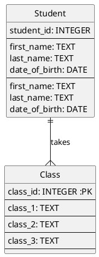

# heading

```plantuml
@startuml
' config

hide circle


entity "Student" {
student_id: INTEGER
--
first_name: TEXT
last_name: TEXT
date_of_birth: DATE
--
first_name: TEXT
last_name: TEXT
date_of_birth: DATE
}

entity "Class" {
class_id: INTEGER :PK
--
class_1: TEXT
--
class_2: TEXT
--
class_3: TEXT
--
}


Student  ||--{ Class : takes
@enduml
```