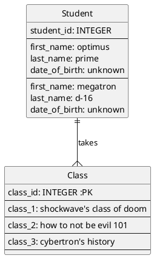

# heading

```plantuml
@startuml
' config

hide circle


entity "Student" {
student_id: INTEGER
--
first_name: optimus
last_name: prime
date_of_birth: unknown
--
first_name: megatron
last_name: d-16
date_of_birth: unknown
}

entity "Class" {
class_id: INTEGER :PK
--
class_1: shockwave's class of doom
--
class_2: how to not be evil 101
--
class_3: cybertron's history
--
}


Student  ||--{ Class : takes
@enduml
```