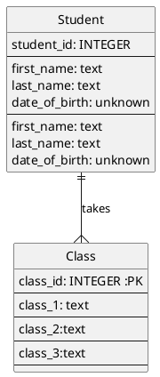

# heading

```plantuml
@startuml
' config

hide circle


entity "Student" {
student_id: INTEGER
--
first_name: text
last_name: text
date_of_birth: unknown
--
first_name: text
last_name: text
date_of_birth: unknown
}

entity "Class" {
class_id: INTEGER :PK
--
class_1: text
--
class_2:text
--
class_3:text
--
}


Student  ||--{ Class : takes
@enduml
```